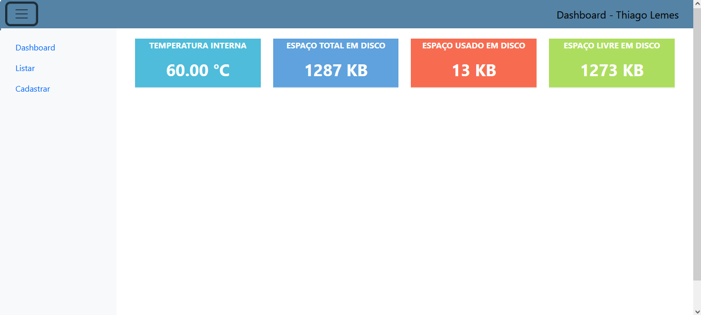

# <b>Projeto Web para ESP32 com PlatformIO</b> - Sistemas Embarcados

<!-- TABLE OF CONTENTS --> 

  
Indície

  <ol>
    <li>
      <a href="#objetivo">Objetivo</a>
    </li>
    <li>
      <a href="#pastas-e-arquivos">Pastas e Arquivos</a>
    </li>
    <li>
      <a href="#sobre">Sobre</a>
    </li>
  </ol>

<!-- objetivo -->
## Objetivo

Este repositório tem como objetivo criar um modelo de página Web para ser utilizado com o <b>ESP32</b>.

Foi utilizado a lib <b>PlartformIO IDE</b> e a linguagem de programação <b>C/C++</b> para o desenvolvimento da mesma.

<!-- pastas-arquivos -->
## Pastas e Arquivos

A estrutura básica das pastas são:

* <b>/data</b> - contém os arquivos <b>html</b> das páginas;
* <b>/src</b> - contém os códigos fontes.

Os arquivos contidos na pasta <b>/src</b> são:

* <b>main.cpp</b> - arquivo principal;
* <b>routes.cpp</b> - arquivo de rotas para navegação das página Web;
* <b>utils</b> - contém duas funções. A primeira é para capturar a temperatura interna do <b>ESP32</b> e a segunda é para capturar o tamanho do armazenamento interno e utilizado.

<!-- sobre -->
## Sobre

Autor: Thiago Vilarinho Lemes  
LinkedIn <a href="https://www.linkedin.com/in/thiago-v-lemes-b1232727" target="_blank">Thiago Lemes</a> 
Home <a href="http://thiagolemes.free.nf" target="_blank">Thiago Vilarinho Lemes</a> 
e-mail: contatothiagolemes@gmail.com | lemes_vilarinho@yahoo.com.br 

